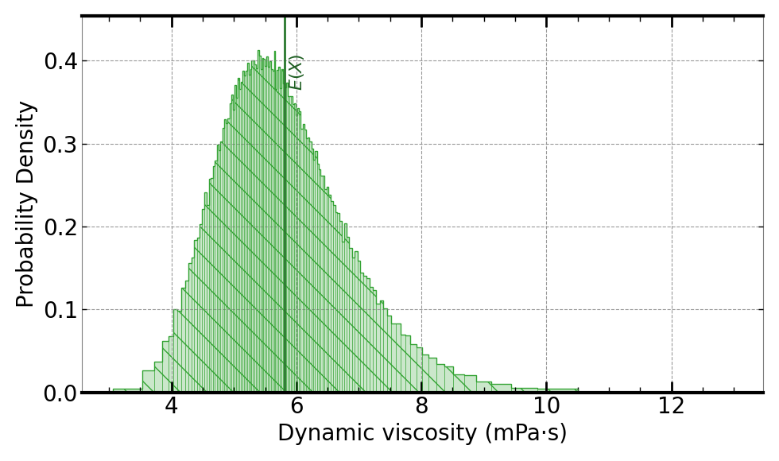

[](https://signaloid.io/repositories?connect=https://github.com/signaloid/Signaloid-Demo-Engineering-NISTUMDynamicViscosity#gh-dark-mode-only)
[](https://signaloid.io/repositories?connect=https://github.com/signaloid/Signaloid-Demo-Engineering-NISTUMDynamicViscosity#gh-light-mode-only)

# MICRO Benchmark: Dynamic Viscosity

Benchmark from Tsoutsouras et al. MICRO paper[^0] for comparison against the NIST Uncertainty Machine[^1].

Calculates the dynamic viscosity of a sodium hydroxide solution in water by modeling the inputs as independent Gaussian variables.

## Inputs

The samples are stored in a text file.
The first line of the file is the number of samples that follow.
See the source code to know which files are used and how.

## Output

The application calculates a single output, the dynamic viscosity of the
solution, selected with `-S 0`.

Example output using Signaloid's C0Pro-S core:



## Building and Running Locally

### Prerequisites

The native build needs GNU Make, a C compiler, and the GNU Scientific Library (GSL).

On macOS, install the Xcode Command Line Tools (which provide `make` and the C
compiler) and then install GSL with [Homebrew](https://brew.sh):
```bash
xcode-select --install
brew install gsl
```

On Linux (Debian/Ubuntu):
```bash
sudo apt-get install -y build-essential libgsl-dev
```

The top-level `Makefile` detects the GSL install location automatically, covering
Homebrew on Apple Silicon (`/opt/homebrew`), Homebrew on Intel (`/usr/local`) and
MacPorts (`/opt/local`), so no further configuration is needed on macOS.

From the repository root, run:
```
make local-build
```
This produces `demo-native-mc` at the repository root.

Run the resulting binary from the repository root, since it reads its
`samples-gaussian-dv_*.csv` sample files by bare filename relative to the
current working directory (symlinks to which exist at the repository root).
For example, to run in Monte Carlo mode:
```
./demo-native-mc -S 0 -M 10000
```
Note that `-M` and `-b` both require `-S`. Using `-M` or `-b` without `-S` exits
with a validation error (exit code 1).


---

## References

[^0]: Vasileios Tsoutsouras, Orestis Kaparounakis, Bilgesu Arif Bilgin, Chatura Samarakoon, James Timothy Meech, Jan Heck, Phillip Stanley-Marbell: The Laplace Microarchitecture for Tracking Data Uncertainty and Its Implementation in a RISC-V Processor. MICRO 2021: 1254-1269

[^1]: Thomas Lafarge and Antonio Possolo. 2015. NIST Uncertainty Machine–User’s Manual. National Institute of Standards and Technology, Gaithersburg (2015).
